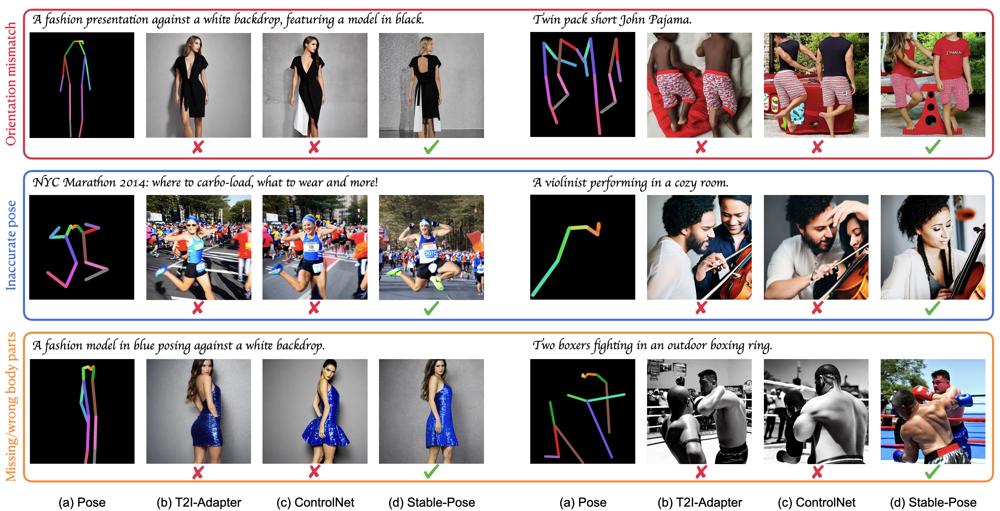
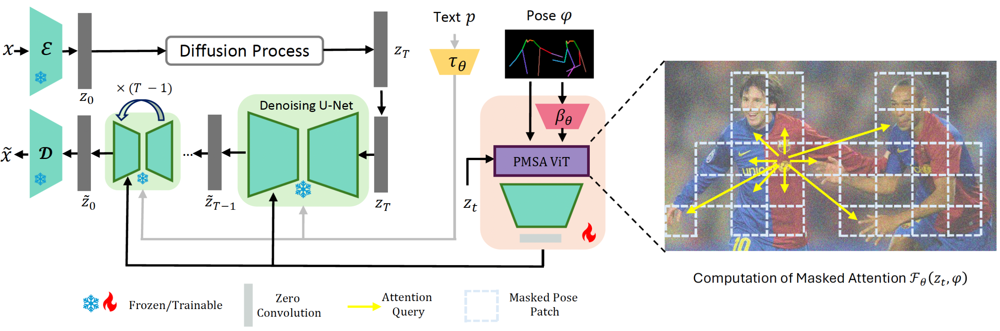

# Stable-Pose
---
Official implementation of [Stable-Pose: Leveraging Transformers for Pose-Guided Text-to-Image Generation](https://arxiv.org/abs/2406.02485).

<p align="center">
  
</p>


Stable-Pose is a novel adapter that leverages vision transformers with a coarse-to-fine pose-masked self-attention strategy, specifically designed to efficiently manage precise pose controls during Text-to-Image (T2I) generation. 

The overall structure of Stable-Pose:
<p align="center">
  
</p>


**Table of Contents**
- [Stable-Pose](#stable-pose)
- [TODO](#todo)
- [Installation](#installation)
- [File structure](#file-structure)
  - [Model and Checkpoints](#model-and-checkpoints)
  - [Data](#data)
  - [Configs](#configs)
  - [Checkpoints and logs](#checkpoints-and-logs)
  - [Evaluation results](#evaluation-results)
- [Usage](#usage)
- [Acknowledgments](#acknowledgments)
- [References](#references)


# Installation
To get started, first prepare the required environment:
```
# create an environment
conda create -n stable-pose python=3.8.5
# activate the created environment
conda activate stable-pose
# recommended pytorch version
conda install pytorch==1.12.1 torchvision==0.13.1 torchaudio==0.12.1 cudatoolkit=11.3 -c pytorch
# install required packages
pip install -r requirements.txt
```
During evaluation, a pretrained pose estimator is needed to predict poses of generated humans. Hence, you might need to install MMPose following this [guide](https://github.com/open-mmlab/mmpose).

# File structure
It's highly recommended to follow our file structure, which allows you to extend the repository to other SOTA techniques easily.
## Model and Checkpoints
We put all the pretrained models we need under 'models' directory:
```
|-- models
    |-- v1-5-pruned.ckpt  # stable diffusion
    |-- higherhrnet_w48_humanart_512x512_udp.pth  # pose esitimator
    |-- init_stable_pose.ckpt  # initialized model for Stable-Pose
```
You may download the Stable Diffusion model from [Hugging Face](https://huggingface.co/runwayml/stable-diffusion-v1-5) and pose esitimator from [HumanSD](https://github.com/IDEA-Research/HumanSD). 
Note that ```init_stable_pose.ckpt``` is the initialized model for Stable-Pose, you might refer to [Usage](#usage) for details.


## Data
We trained and evaluated on [Human-Art](https://idea-research.github.io/HumanArt/) and [Laion-Human](https://arxiv.org/pdf/2304.04269), where we follow [HumanSD](https://github.com/IDEA-Research/HumanSD/tree/main) to download and structure the data. Further, we evaluated on three video datasets:  [UBC Fashion](https://arxiv.org/abs/1910.09139), [DAVIS](https://www.cv-foundation.org/openaccess/content_cvpr_2016/papers/Perazzi_A_Benchmark_Dataset_CVPR_2016_paper.pdf), and [Dance Track](https://openaccess.thecvf.com/content/CVPR2022/papers/Sun_DanceTrack_Multi-Object_Tracking_in_Uniform_Appearance_and_Diverse_Motion_CVPR_2022_paper.pdf), where we extracted video frames and built datasets to test (Codes for preparing video datasets will be released soon). The data path is specified in config files.  

## Configs
Config files are structured as:
```
|-- configs
    |-- stable_pose
        |-- humanart.yaml
    |-- mmpose
        |-- ...
```
Stable-Pose and the training/evaluation datasets are configured in the above YAML file, please feel free to make any changes. The 'mmpose' directory contains the config for pose detector, which will be used in evaluation. 

## Checkpoints and logs
Checkpoints and training logs for stable-pose are stored under 'experiments' directory:
```
|-- experiments
    |-- stable_pose
        |-- run_name (specified in config file)
            |-- last.ckpt
            |-- lightning logs
            |-- log_images
            |-- final.pth
```

## Evaluation results
Evaluation results are also stored similarly:
```
|-- outputs
    |-- stable_pose
        |-- run_name (specified in config file)
            |-- metrics (saved metrics as csv files)
            |-- images (generated images)
```

# Usage
We've released training and test codes with sample commands.
Before training, you might need to initialize the Stable-Pose model with weights of Stable Diffusion model, following [ControlNet](https://github.com/lllyasviel/ControlNet):
```
python prepare_weights.py models/v1-5-pruned.ckpt configs/stable_pose/humanart.yaml models/init_stable_pose.ckpt
```
Training and evluation commands are provided:
```
# please specify config path and initialized model path
python train.py --config configs/stable_pose/humanart.yaml --max_epochs 1 --control_ckpt models/init_stable_pose.ckpt --devices 2 --scale_lr false

# please specify config path and checkpoint path
python eval_pose.py --config_model configs/stable_pose/humanart.yaml --ckpt experiments/stable_pose/run_name/final.pth --scale 7.5
```
For evaluation of image quality (FID, KID), you might need another script:
```
python eval_quality.py
```
Note that for Human-Art, we followed HumanSD and evaluated the quality on each scenario (e.g. cartoon, dance), and the json files are provided in ```val_jsons``` directory.


# Citation

If you find StablePose useful in your research, please cite our paper:

```bibtex
@article{stablepose2024,
    author = {Jiajun Wang, Morteza Ghahremani, Yitong Li, Björn Ommer, Christian Wachinger},
    title = {Stable-Pose: Leveraging Transformers for Pose-Guided Text-to-Image Generation},
    journal = {	arXiv:2406.02485},
    year = {2024},
}
```

# Acknowledgments
This repository is built upon [ControlNet](https://github.com/lllyasviel/ControlNet) and [HumanSD](https://github.com/IDEA-Research/HumanSD),  thanks to their great work!
